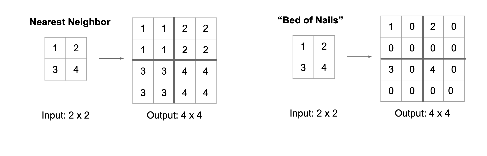

<!-- _class: invert -->
<!-- _paginate: false -->
# Deep Convolutional Generative Adversarial Networks

## Fundamentals and Trends in Vision and Image Processing

### Hallison Paz
#### IMPA, November 11 2021

---

# Key contributions

- Proposal of architecture guidelines for training GANs using convolutions.
- Analysis of the potential of GANs as tools for unsupervised learning

--- 
# Why convolutions

- Spatial coeherence
* Translation invariance
* Multiscale
* Already a good strategy for analysis

---
# Architecture guidelines

- Replace pooling layers with [fractional-]strided convolutions
* Use batch normalization
* Remove fully connected hidden layers for deeper architectures 
* Use **ReLU** in generator, except for the output, which uses **Tanh**.
* Use **LeakyReLU** in the discriminator

---
# Generator Architecture

---
# Discriminator Architecture

- Last layer is flattened and fed into a sigmoid output.

---

# Pooling vs strided convolutions

<!-- _footer: image from Fei-Fei Li & Justin Johnson & Serena Yeung (CS231n, 2017, lecture 11) -->

---
# Downsampling with Pooling

---
# Downsampling with Strided convolutions

<!-- _footer: image from Fei-Fei Li & Justin Johnson & Serena Yeung (CS231n, 2017, lecture 11) -->

---

# Upsampling strategies

<!-- _footer: image from Fei-Fei Li & Justin Johnson & Serena Yeung (CS231n, 2017, lecture 11) -->

---

# Fractional-strided convolutions

<!-- _footer: image from Fei-Fei Li & Justin Johnson & Serena Yeung (CS231n, 2017, lecture 11) -->

---

# Fractional-strided convolutions

- Also called transposed convolution

<!-- _footer: Image from [Transposed Convolution Demystified](https://towardsdatascience.com/transposed-convolution-demystified-84ca81b4baba)-->

---

# Batch Normalization

<!-- _footer: Image from https://stackoverflow.com/questions/65613694/calculation-of-mean-and-variance-in-batch-normalization-in-convolutional-neural -->

---

# Relu x Leaky-Relu

---
<!-- _class: invert -->
<!-- _paginate: false -->

# Training and Results

---
# Training details

* Training images scaling to the range of the tanh activation function [-1, 1]
* SGD with a mini-batch size of 128
* Weights initialized from a zero-centered Normal distribution (std=0.02). 
* In the LeakyReLU, the slope was set to 0.2 
* Adam optimizer using lr=0.0002 and momentum term $β_1=0.5$

---
# Results

<!-- _footer: Generated bedrooms after one epoch of training on LSUN -->
---
# Results

<!-- _footer: Generated bedrooms after five epochs of training on LSUN -->
---

<!-- _class: invert -->
<!-- _paginate: false -->

# GANs as Tools for Unsupervised Learning

---

# Visualizing features activations

- The discrimator learned relevant features of the scene

 

---
# Using features for supervised learning

- Using discriminator's features to train a SVM classifier
 

---
# Walking in the latent space

<!-- _footer: Latent space interpolation -->

---
# Walking in the latent space

- Interpolation has semantics; 
  - It learns a manifold.
* An interesting test to validate results

---
# Vector Arithmetic

---

<!-- _class: invert -->
<!-- _paginate: false -->
# Let's see it in practice...

## ...next class! #statytuned